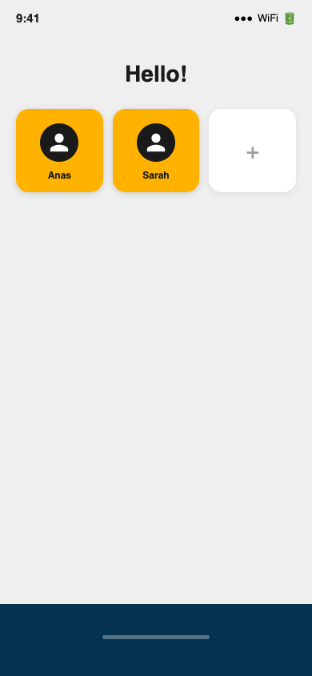
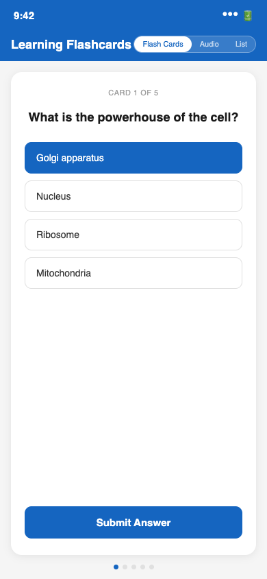

# Embrace

**Hackathon project — AI for Neurodiverse Learners**

Embrace is a Flutter desktop and mobile application that generates personalised study flashcards from images using Azure OpenAI's vision model. Users select an image of their study material, the AI reads it and produces multiple-choice questions, and the app presents them as an interactive quiz with instant feedback.

## Screenshots





## Features

- **AI flashcard generation** — send a photo of any study material to GPT-4o-mini; it returns structured JSON with one question, one correct answer, and three wrong answers per card
- **Interactive quiz** — four-option multiple choice; selected answer highlighted; submit reveals correct/incorrect; auto-advances to next card
- **Multi-user profiles** — local SQLite database; users have a name and a stored learning level; profile persists between sessions
- **Learning style assessment** — three-question onboarding captures preferred learning method, memory style, and content type
- **Cross-platform** — Windows, Linux, macOS, iOS, Android (FFI SQLite initialisation per platform)
- **Segmented view tabs** — Flash Cards, Audio, and List tabs scaffolded (Audio/List placeholders)

## Tech Stack

| Layer | Choice |
|---|---|
| Framework | Flutter SDK 3.7+ (Dart) |
| AI | Azure OpenAI GPT-4o-mini (vision + JSON mode) |
| Local database | SQLite via sqflite + sqflite_common_ffi |
| Persistent storage | shared_preferences |
| File/image input | file_picker, image_picker |
| HTTP | http package + flutter_dotenv |
| UI | Material 3 + cupertino_icons |

## How It Works

### AI Integration

`ApiService.getFlashcardsFromImage()` does the following:

1. Reads the image file and base64-encodes it
2. Sends a multipart message to the Azure OpenAI chat completions endpoint:
   - System prompt: "You are a flashcard creator. Based on the image, create a list of flashcards in JSON format..."
   - User message: text instruction + base64 image URL (`data:image/jpeg;base64/...`)
3. Model: `gpt-4o-mini` with `max_tokens: 2000`, `temperature: 0.7`
4. Response is extracted from `choices[0].message.content`
5. A regex extracts the JSON array from the freeform response
6. JSON is deserialized into a `List<Flashcard>` via the `Flashcard.fromJson` factory

**Flashcard JSON format:**
```json
[
  {
    "question": "...",
    "answer": "...",
    "correct_answer": "...",
    "wrong_answer_1": "...",
    "wrong_answer_2": "...",
    "wrong_answer_3": "..."
  }
]
```

### User Flow

```
/userselect     Select or create a user profile (stored in SQLite)
    |
/assess         3-question learning style assessment
    |
/dataInput      Upload a PDF (UI complete; processing scaffolded)
    |
/present_flashcards
    Phase 1:    Select an image from device
    Phase 2:    "Generate Flashcards" calls Azure OpenAI
    Phase 3:    Quiz loop -- answer, submit, advance
```

### Data Model

```dart
class Flashcard {
  final String question;
  final String answer;
  final String correctAnswer;
  final String wrongAnswer1;
  final String wrongAnswer2;
  final String wrongAnswer3;
}
```

```sql
CREATE TABLE users (
  id                INTEGER PRIMARY KEY AUTOINCREMENT,
  userName          VARCHAR(64) NOT NULL,
  userLearningLevel VARCHAR(512)
);
```

## Project Structure

```
lib/
  main.dart                         # App entry, route table, DB/env init
  models/
    flashcard.dart                  # Flashcard data class + fromJson factory
  services/
    api_service.dart                # Azure OpenAI integration
  Routes/
    route_user_select.dart          # User grid + add user dialog
    route_assessment.dart           # 3-question learning style form
    route_data_input.dart           # PDF file picker screen
    route_flashcards_trial.dart     # Image picker + API call + quiz (active)
    route_present_flashcards.dart   # Static demo flashcards (dev only)
  User-Data/
    user_handler.dart               # SQLite singleton (CRUD)
  Widget/
    add_user_dialog.dart            # New user modal
```

## Setup

### Prerequisites

- Flutter SDK 3.7+
- Azure OpenAI deployment of `gpt-4o-mini` with vision enabled

### Environment

Create a `.env` file in the project root:

```env
OPEN_AI_API_KEY=your-azure-openai-key
```

The API endpoint is configured directly in `api_service.dart`.

### Run

```bash
flutter pub get
flutter run -d windows     # or macos, linux
```

## Hackathon Context

Built for a hackathon on the theme of personalised and inclusive learning. The name "Embrace" reflects the project's focus on accessibility across different learning styles. The foundation supports future extensions: spaced repetition, text-to-speech for audio cards, progress tracking, and PDF-native processing (currently scaffolded).
